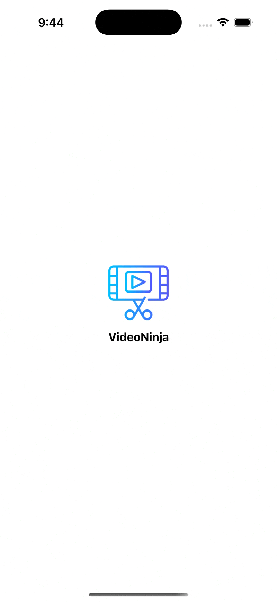

# VideoNinja - iOS Video Editing App

## Screen Recording



## Instructions to Execute the Project

### Prerequisites

- macOS 14 or later
- Xcode 16 or later
- An iOS device or simulator running iOS 15.6 or later

### Steps to Run the Project

1. **Clone the Repository**
   
   ```bash
   git clone https://github.com/usamaeltmsah/VideoNinja.git
   cd VideoNinja
2. **Open the project file**

   ```bash
   open VideoNinja.xcodeproj
3. **Select a simulator and run the project**

Voilà!

```vbnet
Feel free to let me know if you need any further adjustments!
